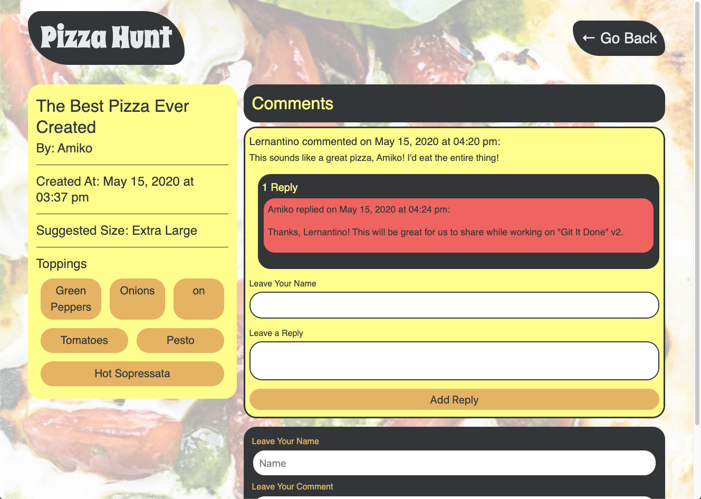

# pizza-hunt

## Description :
```
Pizza Hunt is a social media recipe app where users can post their choice of pizza ingredients, add comments to recipes and create reply thread within comments. 
```

* The requirement from Pizza-Hunt was to add back-end functionality to existing front-end are as below :
```
- Users can create, read, update, and delete data for a pizza in the database
- Users can create, read, update, and delete data for a pizza's comment in the database
- User should be able to add pizza discussion
- User should be able to have offline capabilities
- Add data validation
```

## Languages and other components used : 
```
   * npm (node package manager) 
   * Expess.js  
   * MongoDB ( NoSQL Database)
   * Mongoose 
   * indexedDB (NoSQL client-side storage API)
```

## How to install : 
 ```
 To install the application in your computer follow the steps below: 

 1. Clone the repository in your computer :
    - open the command line and go to the directory where you want to clone the repository.
    - then clone the repo by typing : " git clone git@github.com:miraj00/pizza-hunt.git"

 2. Install node.js on your computer by going to https://nodejs.org/en/  

 3. Install MongoDB by going to : https://www.mongodb.com/try/download/community , then configure MongoDB in your computer

  
 4. Then install below packages by typing in command line :

    - npm init -y
    - npm install mongoose

```


## Below is the screenshot and Deployed application of the Project as per client request ## 




## Deployed Sites ##

[Please click here to see deployed application on Github](https://github.com/miraj00/pizza-hunt)

[Please click here to see deployed application on heroku](https://pacific-wave-04823.herokuapp.com/)


